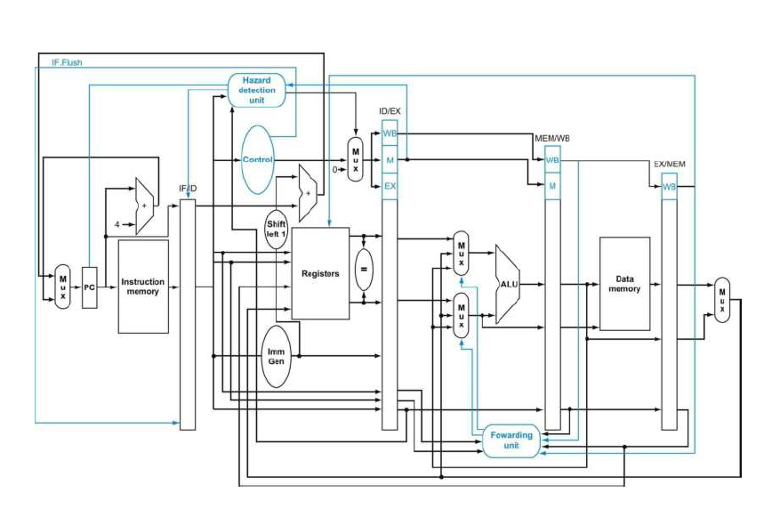

# 5-Stage Pipelined RISC-V 32I Processor Core

## 📌 Project Overview
This repository contains the RTL design of a 32-bit RISC-V processor core (RV32I Instruction Set Architecture) written completely from scratch in Verilog. The microarchitecture features an optimized 5-stage pipeline designed for cycle efficiency and high throughput, implementing advanced hazard resolution techniques modeled after standard computer architecture literature (e.g., *Computer Organization and Design: RISC-V Edition*).

## 🛠️ Microarchitecture & Pipeline Details
* Instruction Set: RV32I (Base Integer Instruction Set)
* Optimized Pipeline Stages: 1. Instruction Fetch (IF): Program Counter logic and Instruction Memory interface.
  2. Instruction Decode (ID) [OPTIMIZED]: Register File read, Control Unit decoding, immediate generation, and Early Branch Resolution. A dedicated equality comparator is implemented here to evaluate branches immediately, reducing the branch penalty to a single cycle.
  3. Execute (EX): Arithmetic Logic Unit (ALU) operations.
  4. Memory (MEM): Data Memory read/write interface.
  5. Writeback (WB): Committing ALU results or Memory data back to the Register File.

## 🚧 Advanced Hazard Resolution & Control Logic
To ensure data integrity and maximize IPC (Instructions Per Cycle), a robust, multi-stage Hazard Detection and Forwarding architecture was implemented:

* Dual Forwarding Units:
  * Main EX-Stage Forwarding: Resolves standard data dependencies by bypassing results directly from the EX/MEM and MEM/WB pipeline registers to the ALU inputs.
  * Dedicated ID-Stage Forwarding: A secondary, highly specialized forwarding unit located in the Decode stage. It specifically routes bypassed data to the early-branch comparator, ensuring branch instructions have the most up-to-date register values without stalling for the ALU.
* **Hazard Detection Unit (lwstall):** Actively monitors for Load-Use data hazards. If a dependent instruction immediately follows a memory load, the unit asserts an lwstall signal, freezing the PC and IF/ID registers while seamlessly inserting a pipeline bubble (zeroing control signals) into the ID/EX registerControl Hazards Optimized branch logic flushes the IF/ID register on a taken branch, cleanly handling the 1-cycle penalty resulting from the early Decode-stage resolution.

## 🔍 Verification Status (UVM In Progress)
*Note: The RTL design is currently complete. The Universal Verification Methodology (UVM) environment architecture is actively in development.*

---
*Architected and Designed by Muhammed Zahid K C*
